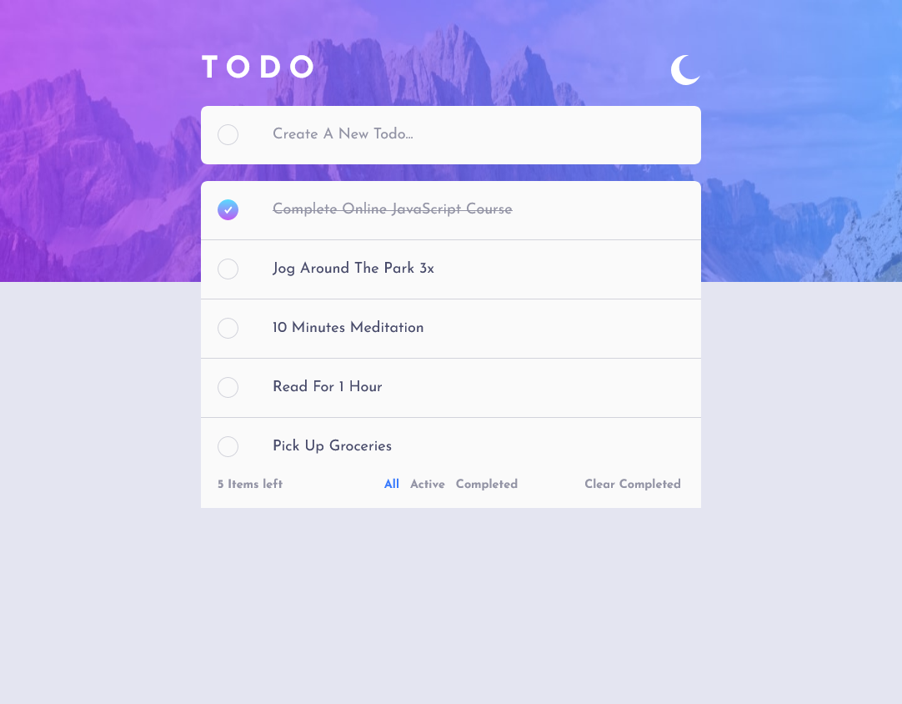
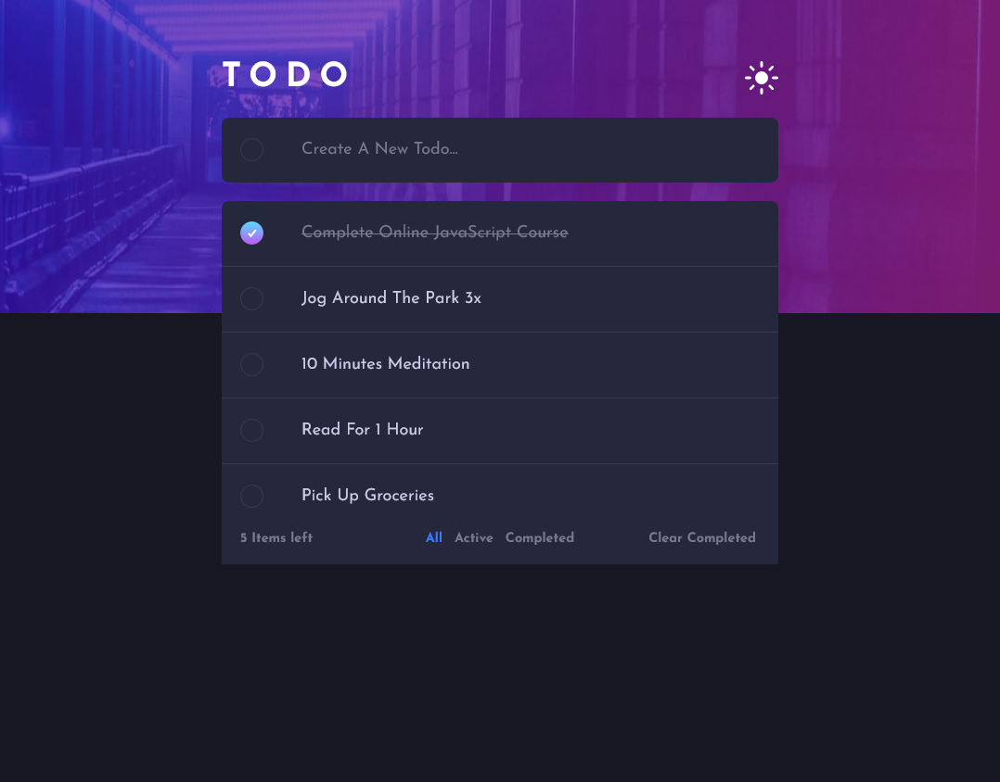

# Frontend Mentor - Todo app solution

This is a solution to the [Todo app challenge on Frontend Mentor](https://www.frontendmentor.io/challenges/todo-app-Su1_KokOW).

## Table of contents

- [Overview](#overview)
  - [The challenge](#the-challenge)
  - [Links](#links)
  - [Screenhots](#screenshots)
- [My process](#my-process)
  - [Built with](#built-with)
  - [Continued development](#continued-development)
- [Author](#author)

## Overview

### The challenge

Users should be able to:

- View the optimal layout for the app depending on their device's screen size
- See hover states for all interactive elements on the page
- Add new todos to the list
- Mark todos as complete
- Delete todos from the list
- Filter by all/active/complete todos
- Clear all completed todos
- Toggle light and dark mode

### Links

- Live Site URL: [Live site URL here](https://todoappaymen.netlify.app)

### Screenshots

## My process

### Built with

- Semantic HTML5 markup
- CSS3
- Flexbox
- CSS Grid
- Media Queries
- [React](https://reactjs.org/) - JS library
- Redux

### Continued development

- Drag and Drop could be done.
- Make the application full stack.

## Author

- Github Repo - [Aymen Boudabia](https://www.github.com/aymenfisher)
- Frontend Mentor - [@aymenfisher](https://www.frontendmentor.io/profile/yourusername)
- Linkedin - [Aymen Boudabia](https://www.linkedin.com/in/aymen-boudabia)

